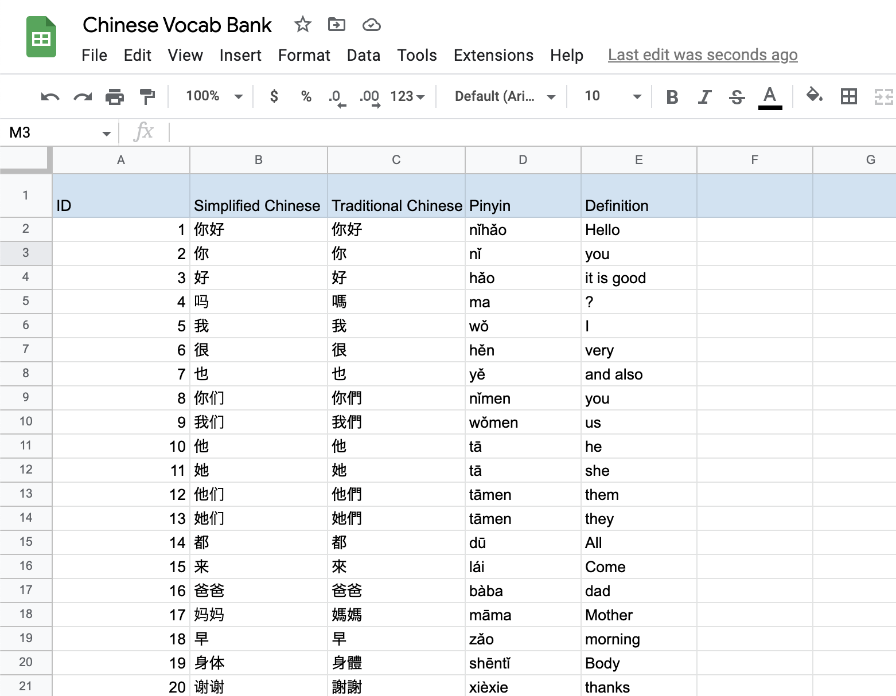
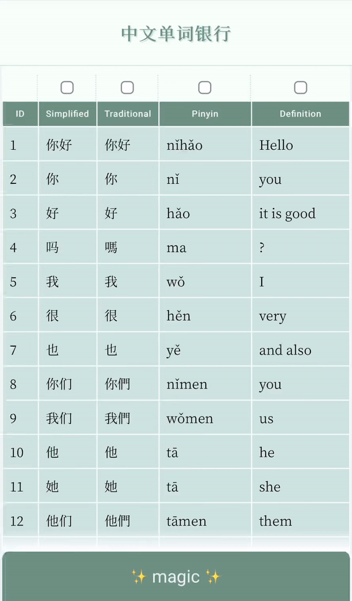

## Chinese Vocab Bank

Built a little app for personal use to assist my Chinese studies.

A typical studying tactic in Japan is to use a transparent red plastic sheet to cover up answers(writted in red) to aid memorization. I wanted to incorporate the same studying tactic, but digitally.

### DB

For the database, I made a simple Google Spreadsheet that takes an input in simplified chinese in one column that outputs traditional chinese, pinyin, and the translated definition in English in different columns. All I have to do is keep adding new vocab characters into the spreadsheet.

### Frontend

Vocabulary data is fetched from the Google Spreadsheet.
By default, all rows of data are visible, and I could choose which type of data (columns) I would like to "lock" to keep it hidden. All rows within the locked columns are hidden until an action button is held down to trigger a reveal.
